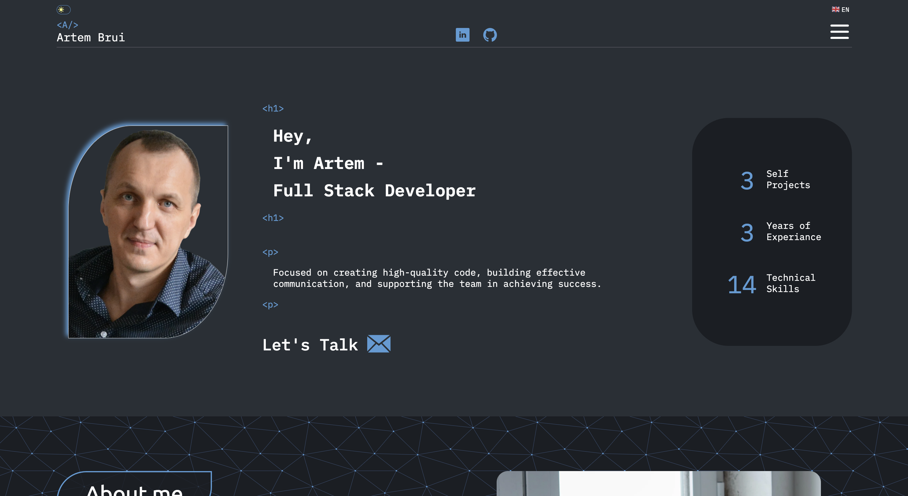

<h1 align="center">Hi 👋, I'm Artem</h1>
<h3 align="center">I'm a Full Stack Developer specializing in the MERN stack (MongoDB, Express, React, Node.js). I’m passionate about building interactive web applications and always eager to learn new technologies and improve my skill set.</h3>

 

 

<h2 align="center">Languages and Tools</h2>

<table align="center" width="100%">
  <tr>
    <td align="center">
       
      HTML
    </td>
    <td align="center">
       
      CSS
    </td>
    <td align="center">
       
      SASS
    </td>
    <td align="center">
       
      Bootstrap
    </td>
    <td align="center">
       
      Tailwind
    </td>
    <td align="center">
       
      Bulma
    </td>
    <td align="center">
       
      Figma
    </td>
  </tr>
  <tr>
    <td align="center">
       
      Git
    </td>
    <td align="center">
       
      JavaScript
    </td>
    <td align="center">
       
      TypeScript
    </td>
    <td align="center">
       
      React
    </td>
    <td align="center">
       
      Redux
    </td>
    <td align="center">
       
      Express
    </td>
    <td align="center">
       
      MongoDB
    </td>
  </tr>
</table>
 
 

<h2 align="center">Connect with me:</h2>

 <a href="https://linkedin.com/in/artem-brui-563252288" target="blank" style="color: white;">
  My Porfolio Website 
   
 </a>

<h4 align="center" style="margin: 0">My Email: artembryj@gmail.com</h4>

 <a href="https://linkedin.com/in/artem-brui-563252288" target="blank" style="color: white;">My Linkedin Profile: Artem Brui</a>

