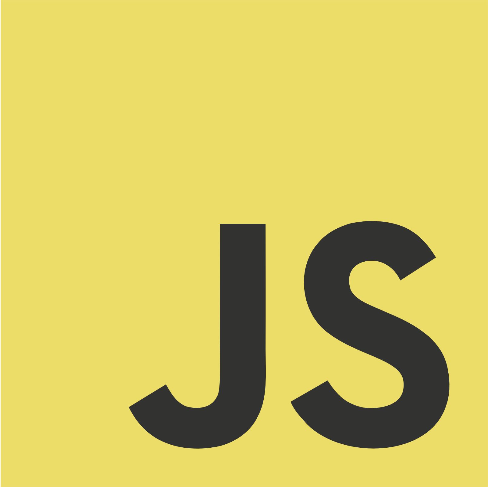
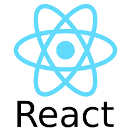
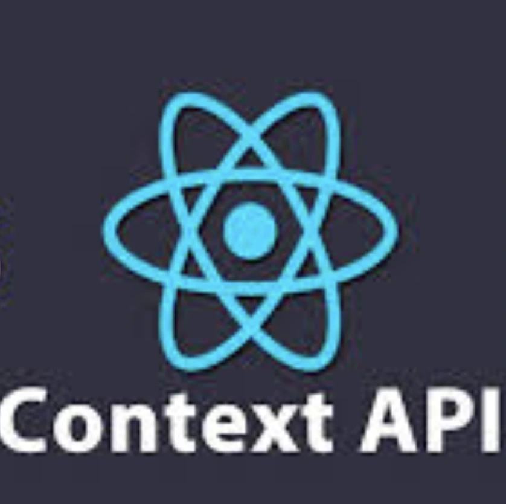
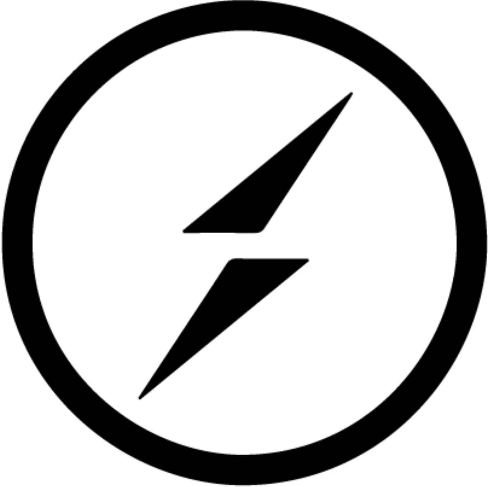

# Full Stack Web Developer

## Contacts

[artembryj@gmail.com](mailto:artembryj@gmail.com)

[Artem Brui - LinkedIn](https://linkedin.com/in/artem-brui)

## Tech Stack

| HTML | CSS | SASS | Bootstrap | Tailwind | Bulma | Figma | JavaScript | TypeScript |
| :---: | :---: | :---: | :---: | :---: | :---: | :---: | :---: | :---: |
|  |  |  |  |  |  |  |  |  |

| React | Context API | REST API | Redux | Express | MongoDB | Socket.io | Git |
| :---: | :---: | :---: | :---: | :---: | :---: | :---: | :---: |
|  |  |  |  |  |  |  |  |

## My Works

<h3>People App</h3>

  <table>
    <tr>
      <td width="40%" align="center">
        
         
         
        <table>
          <tr>
            <td>
              
            </td>
            <td>
              
            </td>
          </tr>
        </table>
      </td>
      <td align="left">
        <strong>Key features:</strong> 
        - Advanced search with multiple parameters (name, parents, gender, century) 
        - URL-based state management for shareable search results 
        - Real-time filtering and sorting capabilities 
        - Responsive design with modern UI components 
        - Efficient data handling with loading states  
        <strong>Technical stack:</strong> 
        - React 19 
        - TypeScript 
        - React Router 
        - Bulma CSS 
        - Font Awesome 
        - GitHub Pages 
      </td>
    </tr>
  </table>

