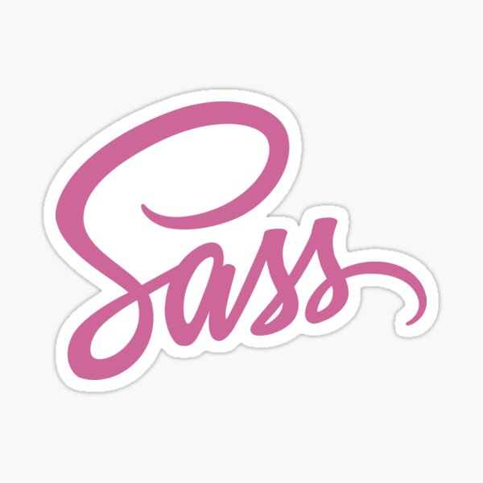

# Full Stack Web Developer

## Contacts

[artembryj@gmail.com](mailto:artembryj@gmail.com)

[Artem Brui - LinkedIn](https://linkedin.com/in/artem-brui)

## Tech Stack

|                                    HTML                                    |                                   CSS                                   |                                    SASS                                    |                                         Bootstrap                                         |                                        Tailwind                                         |                                     Bulma                                     |                                     Figma                                     |                                          JavaScript                                          |                                          TypeScript                                          |
| :------------------------------------------------------------------------: | :---------------------------------------------------------------------: | :------------------------------------------------------------------------: | :---------------------------------------------------------------------------------------: | :-------------------------------------------------------------------------------------: | :---------------------------------------------------------------------------: | :---------------------------------------------------------------------------: | :------------------------------------------------------------------------------------------: | :------------------------------------------------------------------------------------------: |
|  |  |  |  |  |  |  |  |  |

|                                     React                                     |                                           Context API                                            |                                        REST API                                         |                                     Redux                                     |                                       Express                                       |                                       MongoDB                                       |                                        Socket.io                                        |                                   Git                                   |
| :---------------------------------------------------------------------------: | :----------------------------------------------------------------------------------------------: | :-------------------------------------------------------------------------------------: | :---------------------------------------------------------------------------: | :---------------------------------------------------------------------------------: | :---------------------------------------------------------------------------------: | :-------------------------------------------------------------------------------------: | :---------------------------------------------------------------------: |
|  |  |  |  |  |  |  |  |

## My Works

<h3>People App</h3>

  <table>
    <tr>
      <td width="40%" align="center">
        
      </td>
      <td align="left">
        <strong>Key features:</strong> 
        - Advanced search with multiple parameters (name, parents, gender, century) 
        - URL-based state management for shareable search results 
        - Real-time filtering and sorting capabilities 
        - Responsive design with modern UI components 
        - Efficient data handling with loading states  
        <strong>Technical stack:</strong> 
        - React 19 
        - TypeScript 
        - React Router 
        - Bulma CSS 
        - Font Awesome 
        - GitHub Pages
      </td>
    </tr>
  </table>

