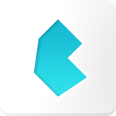

# Full Stack Web Developer

## Contacts

[artembryj@gmail.com](mailto:artembryj@gmail.com)

[Artem Brui - LinkedIn](https://linkedin.com/in/artem-brui)

## Tech Stack

### Layout Design
| HTML | CSS | SASS | Bootstrap | Tailwind | Bulma | Figma |
| :---: | :---: | :---: | :---: | :---: | :---: | :---: |
|  |  |  |  |  |  |  |

### Frontend Development
| JavaScript | TypeScript | React | Context API | Redux | Git |
| :---: | :---: | :---: | :---: | :---: | :---: |
|  |  |  |  |  |  |

### Backend Development
| Express | MongoDB | Socket.io | REST API |
| :---: | :---: | :---: | :---: |
|  |  |  |  |

### Performance Marketing
| Google Ads | Facebook Ads | Google Analytics | Google Tag Manager | Facebook API |
| :---: | :---: | :---: | :---: | :---: |
|  |  |  |  |  |

### Content Creation
| Adobe Photoshop | Adobe Premiere |
| :---: | :---: |
|  |  |

## My Works

### --- Books-Table (Frontend + Backend)
#### TECH FOCUS: React, Context API, React Router, UrlSearchParams
| Demo | Links |
| :---: | :---: |
|  |
  
 |

| Key Features | Technical Stack |
| :---: | :---: |
|
- FRONTEND - Styled by Bulma CSS and custom styles - FRONTEND - Fully responsive and mobile-friendly interface - FRONTEND - Efficient state handling using Reducers and Dispatch - FRONTEND - Universal function for handling API requests, supporting GET, POST, PATCH, and DELETE methods - FRONTEND - Error handling and loading states for a smooth user experience - FRONTEND - Clean and intuitive design with icon integration for enhanced UX - FRONTEND - Deployed on OnRender server for seamless access and scalability - BACKEND - Utilizes MongoDB for robust and scalable data storage - BACKEND - RESTful API with universal request handler for efficient data processing - BACKEND - Secure data handling practices to protect user information - BACKEND - Built with Node.js and Express.js for fast and reliable server-side operations - BACKEND - Deployed on OnRender server for reliable backend services 
|
- FRONTEND - React - FRONTEND - React Router - FRONTEND - TypeScript - FRONTEND - SASS - FRONTEND - Bulma CSS Framework and a few custom styles - FRONTEND - Context API with Reducer and Dispatch - FRONTEND - Universal function for API requests - FRONTEND - Icon Library FontAwesome - BACKEND - Node.js - BACKEND - TypeScript - BACKEND - Express.js - BACKEND - MongoDB for database - BACKEND - Universal request handler - BACKEND - Secure and efficient data handling 
|

. . . . . . . . . . . . . . . . . . . . . . . . . 
### --- People App
#### TECH FOCUS: React, Context API, React Router, UrlSearchParams
| Demo | Links |
| :---: | :---: |
|  |
  
 |

| Key Features | Technical Stack |
| :---: | :---: |
|
- Advanced search with multiple parameters (name, parents, gender, century) - URL-based state management for shareable search results - Real-time filtering and sorting capabilities - Responsive design with modern UI components - Efficient data handling with loading states 
|
- React 19 - TypeScript - React Router - Context API - UrlSearchParams - Bulma CSS - Font Awesome - GitHub Pages 
|

. . . . . . . . . . . . . . . . . . . . . . . . . 
### --- Todo App
#### TECH FOCUS: React, Context API, React Router, Local Storage
| Demo | Links |
| :---: | :---: |
|  |
  
 |

| Key Features | Technical Stack |
| :---: | :---: |
|
- Full CRUD operations for todos (Create, Read, Update, Delete) - Local storage persistence for data management - Bulk actions (complete all, clear completed) - Real-time filtering - Mobile-responsive design 
|
- React 19 - TypeScript - Context API - LocalStorage - SASS - Bulma CSS - Font Awesome 
|

. . . . . . . . . . . . . . . . . . . . . . . . . 
### --- Pagination
#### TECH FOCUS: React, Pagination Solution
| Demo | Links |
| :---: | :---: |
|  |
  
 |

| Key Features | Technical Stack |
| :---: | :---: |
|
- Adjust number of items per page (3, 5, 10, 20) - Navigate through pages with intuitive controls - Display current page and item range - Responsive pagination component - Clean and intuitive interface using Bootstrap 5 
|
- React 19 - TypeScript - Bootstrap 5 
|

. . . . . . . . . . . . . . . . . . . . . . . . . 
### --- Game 2048
#### TECH FOCUS: JavaScript, SASS, Local Storage
| Demo | Links |
| :---: | :---: |
|  |
  
 |

| Key Features | Technical Stack |
| :---: | :---: |
|
- Smooth tile movement and merging - Random tile generation (2 or 4) - Score tracking (saving in Local Storage) - Win/lose conditions - Keyboard arrow keys support - Touch swipe support for mobile - Responsive design for all devices 
|
- HTML5 - CSS / SASS - JavaScript - Local Storage - GitHub Pages 
|

. . . . . . . . . . . . . . . . . . . . . . . . . 
### --- MET Landing Page
#### TECH FOCUS: HTML, SASS
| Demo | Links |
| :---: | :---: |
|  |
  
 |

| Key Features | Technical Stack |
| :---: | :---: |
|
- Adapts seamlessly to different screen sizes and devices - Implementation of Header functionality without JavaScript - Modern aesthetics with contemporary design principles - Engaging components to enhance user experience - Smooth animations and transitions 
|
- HTML5 - CSS / SASS - GitHub Pages 
|

. . . . . . . . . . . . . . . . . . . . . . . . . 